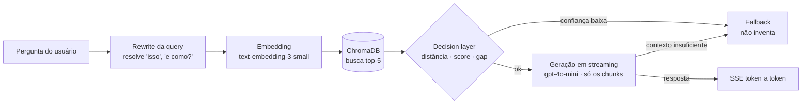

# 🔭 Assistente de IA — Caça Asteroides MCTI

Assistente conversacional (RAG) que tira dúvidas de participantes do programa de ciência cidadã **Caça Asteroides MCTI** (MCTI · AEB · IASC/NASA) sobre inscrição, campanhas, regras e o software de análise astronômica.

O participante pergunta em linguagem natural; o sistema faz **busca semântica** sobre o conteúdo oficial do programa e responde **ancorado nas fontes**. Quando a informação não está no material, ele **avisa em vez de inventar** — num contexto educacional e científico, isso é requisito, não detalhe.

> **Status:** em produção e em uso real. Apresentado oficialmente no **II Encontro Internacional Caça Asteroides** (auditório do CNPq, Brasília, 2026).
> **Teste ao vivo:** https://caçaasteroides.app


---

## Como funciona

O coração do sistema é um pipeline de RAG com uma **camada de decisão** que escolhe responder ou recusar, em vez de responder sempre.



1. **Rewrite da query** — reescreve a última pergunta para que ela faça sentido sozinha (resolve pronomes e perguntas vagas como *"e como?"*), usando as últimas mensagens da conversa. Sem histórico, devolve a própria query (custo zero). Qualquer falha cai de volta na query original — o sistema nunca fica pior do que sem reescrita.
2. **Retrieval** — gera o embedding da query e busca os 5 chunks mais próximos no ChromaDB. As distâncias são **normalizadas em scores de 0 a 1** para facilitar a decisão.
3. **Decision layer** — antes de gerar, decide se há contexto bom o suficiente, olhando **distância do topo, score, o *gap* entre o 1º e o 2º resultado e quantos chunks são relevantes**. Se a confiança for baixa, bloqueia e devolve o fallback.
4. **Geração em streaming** — responde com `gpt-4o-mini`, **baseada apenas nos chunks recuperados**. Se mesmo com contexto o modelo concluir que não dá para responder, emite um marcador interno e o sistema entrega o fallback. A resposta volta **token a token via SSE**.

---

## Stack

**Backend** · Python 3.11 · FastAPI · ChromaDB · OpenAI (`text-embedding-3-small` + `gpt-4o-mini`) · SlowAPI (rate limit) · Uvicorn
**Frontend** · Next.js 14 (App Router) · TypeScript · Tailwind CSS · streaming SSE
**Infra** · Docker · Railway (backend) · Vercel (frontend)

---

## Estrutura do projeto

```
caca-asteroides-rag/
├── backend/                 # API FastAPI + pipeline RAG
│   ├── api/                 # app, rotas (/chat, /health), middleware, rate limit, logging
│   ├── services/            # pipeline · retrieval · decision · rewrite_query · generate_answer
│   ├── data/                # base de conhecimento (JSON estruturado em chunks)
│   ├── scripts/             # index_documents.py — gera os embeddings no ChromaDB
│   ├── tests/               # avaliação de retrieval, decision layer, geração e memória
│   ├── chroma_db/           # banco vetorial persistido (versionado)
│   └── Dockerfile
├── frontend/                # chat em Next.js 14 + Tailwind
├── benchmark/               # testes de carga (k6) + load_test.py (TTFT, percentis)
└── docker-compose.yml
```

---

## Rodando localmente

### Pré-requisitos
- Python 3.11+ e Node.js 18+
- Uma `OPENAI_API_KEY`

### Backend

**Opção A — Docker (recomendada):**
```bash
# na raiz, crie um arquivo .env com:
#   OPENAI_API_KEY=sua_chave
docker compose up --build
# API em http://localhost:8010
```

**Opção B — local sem Docker:**
```bash
cd backend
python -m venv .venv && source .venv/bin/activate   # Windows: .venv\Scripts\activate
pip install -r requirements.txt

# crie backend/.env com OPENAI_API_KEY=sua_chave
uvicorn api.app:app --reload --port 8010
```

> O banco vetorial (`backend/chroma_db/`) já vem indexado no repositório, então a API sobe pronta para responder.
> **Só** é preciso reindexar se você editar a base em `backend/data/`:
> ```bash
> python scripts/index_documents.py
> ```

### Frontend
```bash
cd frontend
npm install
cp .env.local.example .env.local        # ajuste NEXT_PUBLIC_API_URL se necessário
npm run dev                             # http://localhost:3000
```

---

## Configuração (variáveis de ambiente)

| Variável | Lado | Padrão | Descrição |
|---|---|---|---|
| `OPENAI_API_KEY` | backend | — | Chave da OpenAI (obrigatória). |
| `RATE_LIMIT_ENABLED` | backend | `true` | Liga/desliga o rate limit. Desligue ao rodar testes de carga. |
| `PORT` | backend | `8010` | Porta da API. |
| `NEXT_PUBLIC_API_URL` | frontend | — | URL base da API FastAPI (sem barra no final). |

---

## API

**`POST /chat`** — recebe a pergunta e responde via **SSE** (streaming).

```json
{
  "message": "como me inscrevo no programa?",
  "history": [
    { "role": "user", "content": "o que é o caça asteroides?" },
    { "role": "assistant", "content": "É um programa de ciência cidadã..." }
  ]
}
```
- `message`: 3 a 1000 caracteres · `history`: até 10 mensagens.
- Eventos do stream: `metadata` (informa se vai responder) · `token` (pedaço da resposta) · `error` · `done`.

**`GET /health`** — checagem simples (`{ "status": "ok" }`).

---

## Testes e avaliação

Além de testes funcionais, o projeto tem **scripts de avaliação** do que mais importa num RAG — a qualidade da recuperação e o acerto da camada de decisão (`backend/tests/`):

- avaliação do **retrieval** (os chunks certos sobem para o topo?)
- avaliação da **decision layer** (ela responde quando deve e recusa quando deve?)
- testes de **geração**, **streaming** e **memória/multi-turno**

**Carga** (`benchmark/`) — para responder *"aguenta dezenas a centenas de usuários simultâneos?"*:
```bash
# desligue o rate limit no alvo antes (RATE_LIMIT_ENABLED=false)
pip install httpx
python benchmark/load_test.py          # rampa 10→25→50→75→100, mede TTFT e percentis
# ou, com k6:
k6 run benchmark/smoke.js              # fumaça
k6 run benchmark/load.js              # carga constante
k6 run benchmark/stress.js           # rampa até quebrar
```
O load test mede **TTFT (time to first token)** — o tempo até a resposta *começar* a aparecer, que é o que o usuário sente — e percentis **p95/p99**, porque num evento ao vivo o que importa não é a média, é a pessoa azarada da fila.

---

## Lições aprendidas

Mais do que "plugar um LLM", este projeto me ensinou que **um RAG bom se constrói observando dados, não chutando regras**:

- **A informação está nas distâncias.** O ChromaDB devolve distâncias; o difícil não é buscar, é decidir *se a busca foi boa o suficiente para responder*. A `decision layer` nasceu de **observar os padrões de distância/score de perguntas reais** — onde o sistema acertava, onde alucinava — e só então definir limiares (distância do topo, *gap* entre 1º e 2º, número de chunks relevantes). Foi um ciclo de **medir → achar padrão → ajustar → testar de novo**, não um número mágico.
- **Recusar é uma feature.** Num contexto científico, uma resposta errada é pior que um "não sei". O sistema prefere o fallback (com o e-mail de contato) a inventar — e isso precisa ser garantido em mais de um ponto do pipeline (decision layer + marcador de recusa na geração).
- **Pergunta vaga quebra busca semântica.** *"E como?"* ou *"quero participar"* não têm sinal suficiente para um bom embedding. O passo de **rewrite** resolveu boa parte das falhas de *"às vezes responde, às vezes não"*, tornando a pergunta autônoma antes de buscar.
- **O que o usuário sente é o TTFT.** Streaming e a medição de *time to first token* mudaram a percepção de velocidade muito mais do que otimizar o tempo total.
- **Produção é observação contínua.** Logging estruturado com `request_id` em cada etapa foi o que permitiu enxergar o caminho de cada pergunta e calibrar o sistema com base em uso real — e não em suposição.

---

## Próximos passos (roadmap)

- [ ] **Coletar feedback** do usuário (👍/👎) por resposta, para alimentar a recalibração.
- [ ] **Melhorar o chunking** da base de conhecimento para buscas ainda mais precisas.
- [ ] **Observabilidade**: dashboard de métricas (latência, taxa de fallback, perguntas sem resposta) a partir dos logs.
- [ ] **Endurecer o CORS** em produção (restringir métodos/headers em vez de `*`).
- [ ] **Rate limit persistente** (hoje em memória) para escalar com múltiplas instâncias.
- [ ] **Cobertura de testes** e avaliação automatizada rodando em CI.

---

## Créditos

**Caça Asteroides MCTI** é uma iniciativa de ciência cidadã do **MCTI** e da **AEB**, em parceria com o **IASC** (parceiro oficial da NASA), com coordenação do **Observatório Nacional**, **UNILA** e **UFMS**.

Assistente de IA desenvolvido por **Luís Filipe Silva Santos** · [GitHub](https://github.com/Luissantos20)

---

## Licença

O **código** deste projeto está sob a licença **MIT** — veja o arquivo [LICENSE](LICENSE).

O conteúdo do programa (`backend/data/`) e a identidade visual (logos em `frontend/public/`) são de propriedade do **Caça Asteroides MCTI** e **não** estão cobertos por esta licença.
